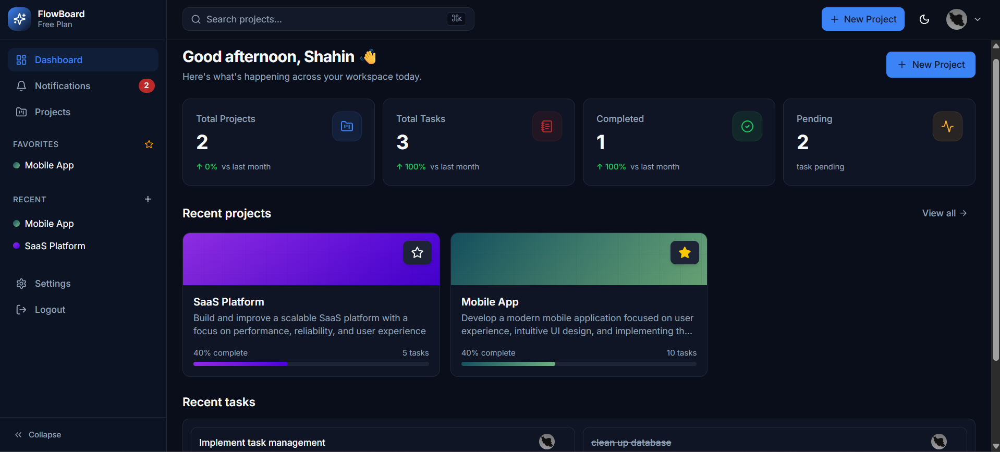
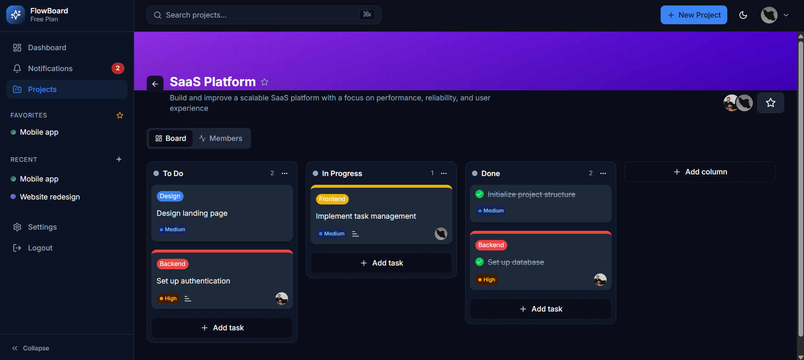

# FlowBoard Frontend

Frontend application for **FlowBoard**, a modern project management platform built with **Next.js**, **React**, and **TypeScript**.

The application provides a responsive interface for managing projects, tasks, team members, notifications, and collaborative workflows.

## 🚀 Features

* 📊 Dashboard with project and task statistics
* 📁 Project management
* ✅ Task and column management
* 🖱️ Drag & Drop task and column reordering
* 👥 Team member management
* 🔔 Notifications
* ⭐ Favorite projects
* 🔐 Authentication
* 📱 Responsive design
* 🌙 Light and dark mode
* ⚡ Server-side data fetching and client-side caching
* 🎨 Modern and reusable UI components

## 🛠️ Tech Stack

* **Next.js**
* **React**
* **TypeScript**
* **TanStack Query**
* **Zustand**
* **Tailwind CSS**
* **dnd-kit**
* **React Hook Form**
* **Zod**
* **Shadcn/ui**
* **sonner**
* **Lucide React**

## 📸 Screenshots

### Dashboard



### Project Board



## 📂 Project Structure

The application follows a feature-oriented structure:

```text
src/
├── app/
├── components/
├── hooks/
├── store/
├── lib/
└── ...
```

The project separates reusable UI components, hooks, state management, API utilities, and application routes to keep the codebase maintainable and scalable.

## ⚙️ Getting Started

### Prerequisites

Make sure you have:

* Node.js 20+
* pnpm

### Installation

Clone the repository:

```bash
git clone https://github.com/KasraMg/flowboard-frontend.git

cd flowboard-frontend
```

Install dependencies:

```bash
pnpm install
```

### Environment Variables

Create a `.env.local` file in the project root:

```env
NEXT_PUBLIC_BACKEND_URL=http://localhost:8000
BACKEND_URL=http://localhost:8000
NODE_ENV=development
```

For production, configure the backend URL according to your deployment environment.

### ▶️ Running the Application

Start the development server:

```bash
pnpm dev
```

The application will be available at:

```text
http://localhost:3000
```

### Production Build

```bash
pnpm build
```

Start the production server:

```bash
pnpm start
```

## 🔗 Backend

FlowBoard uses a separate **NestJS backend API**.

[View Backend Repository](https://github.com/KasraMg/flowboard-backend)

## 🌐 Live Demo

[FlowBoard](https://flowboarrd.vercel.app)

## 👨‍💻 Author

**Kasra Mg**

[GitHub](https://github.com/KasraMg)
